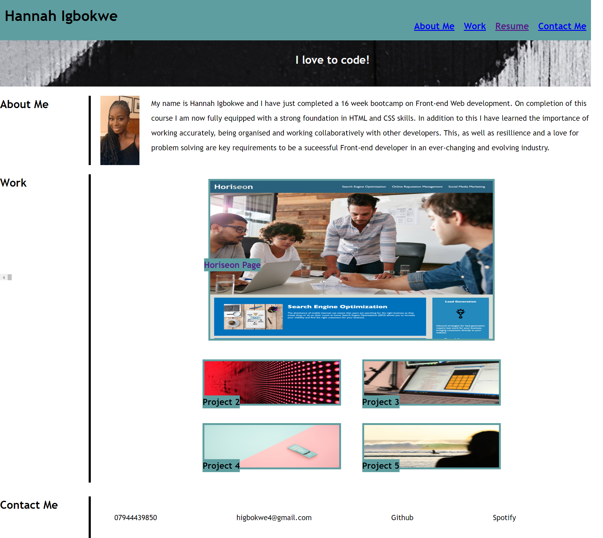

# hIgbokwePortfolio
# <hIgbokwePortfolio>

## Description

I have created this portfolio to showcase my projects to potential employers. This portfolio is a working document so I will be updating it with future projects from the EdX course as well as my own personal projects. This portfolio will also be evidence to see just how much my skills improve over the 16 weeks of the course. I am excited to the progress I make!

## Installation

Deployed on GitHub Pages

[This is the link to my webpage](https://higbokwe23.github.io/hIgbokwePortfolio/)

[This is the link to my git hub repo](https://github.com/HIgbokwe23/hIgbokwePortfolio)

## Usage

To be used by myself and future employers.

## Credits

## License

MIT
---

